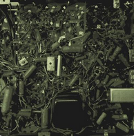

<p align="center">
  
</p>

## Py_Pass_Gen
Author: William Ponton

January, 2019

### Contact

Email: <a href="mailto:waponton@gmail.com">waponton@gmail.com</a>

Github: <a href="https://github.com/gorbulus">gorbulus</a>

## Description
Welcome to Py_Pass_Gen, a simple program that makes passwords and saves them to a file.

I enjoy writing password programs when learning new languages.


## Goals

1. Automatically create a file to store the passwords.
2. Continue creating passwords until the user chooses to exit.
3. Provide a unique combination of upper chars, lower case chars, and special chars.
4. User entered password name and length.
5. Save completed passwords to the file.

## Dependencies
If you want to run tests.py ```pip install -r dev-requirements.txt```

## Password Module: 
This section uses the ```random``` module to generate four different lists.

### Valid characters
Each list is made of random choices from four different categories:
- UPPER CASE (A - Z)
- LOWER CASE (a - z)
- INTEGER (0 - 9)
- SYMBOLS (#, $, %, &)

### Lists of ASCII Integers
The lists are populated by a range of ASCII Integers based on their category.
- UPPER CASE (67 - 90)
- LOWER CASE (97 - 122)
- INTEGER (48 - 57)
- SYMBOLS (35, 36, 37, 38)

```charListUpper = list(range(67, 91))```
  
  ```charListLower = list(range(97, 123))```
  
  ```intList = list(range(48, 58))```
  
  ```symList = list(range(35, 39))```
  
### Probability

The ```UPPER CASE``` and ```LOWER CASE``` lists are longer than the ```INTEGER``` and ```SYMBOLS``` lists, so we need a way to keep the selections even between the four lists.

### Character pool

To even the probability of a pick from each list, a second list of random items from the four parent lists is created to form a password pool that the password will be drawn from.

```passwordList += [upperPick, lowerPick, intPick, symPick]```

### Password creation

A third ```passwordList``` is returned of random characters from each of the previous lists.

```password += chr(random.choice(passwordList))```

### Support

Having trouble with Py_Pass_Gen? 

Get help at: [gorbulus](waponton@gmail.com) and we’ll help you sort it out.
